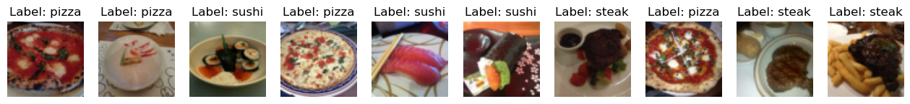
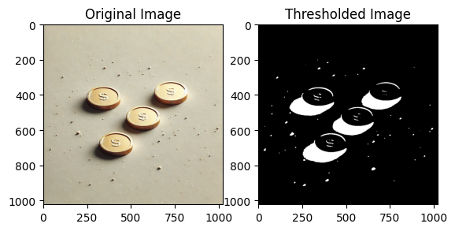
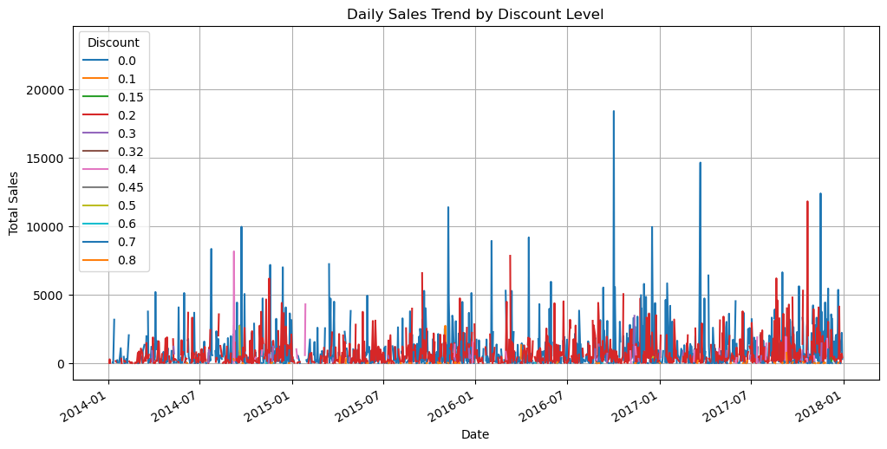
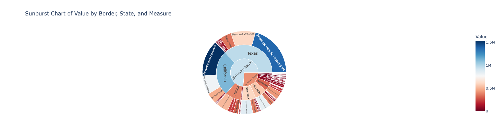
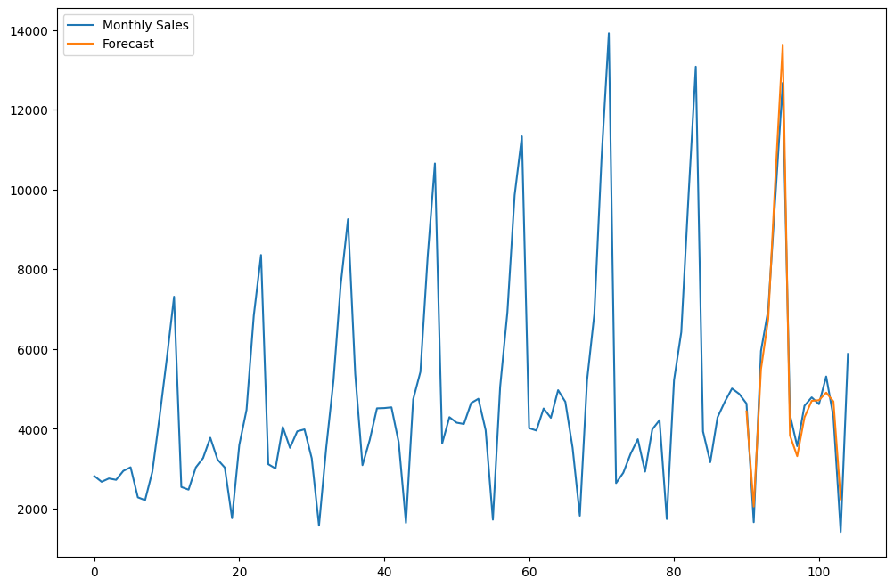

# Machine Learning Practice

A collection of Jupyter notebooks for practicing and exploring machine learning, deep learning, computer vision, time series, and data visualization. Organized by topic for easy navigation.

## Project Structure

```
MachineLearningPractice/
├── Classical ML/          # Traditional ML algorithms & data science
├── Computer Vision/       # Image classification & PyTorch vision
├── Data Visualization/    # Plotly, Matplotlib & exploratory viz
├── Deep Learning/         # Neural networks, PyTorch & Keras
├── VariousModelTraining/  # Homework & assignment notebooks
└── TimeSeries/            # ARIMA & time series analysis
```

## Contents by Category

## Highlights

| Notebook | Category | What it does |
|----------|----------|--------------|
| Pytorchpizzasteaksushi | Computer Vision | Multi-class food image classifier using PyTorch with transfer learning |
| custompt11 | Computer Vision | Custom PyTorch CNN built and trained from scratch |
| Data Augmentation | Computer Vision | Image augmentation techniques using torchvision transforms |
| IRIS | Classical ML | 6 classification algorithms compared with cross-validation and metrics |
| AmznStock series | Classical ML | Amazon stock analysis across 4 progressive notebooks — EDA, feature engineering, trend analysis |
| HousingDataset | Classical ML | Regression on housing data — feature selection, preprocessing, model evaluation |
| kmeans | Classical ML | K-means clustering with elbow method and cluster visualization |
| pipeline / pipeline1 | Classical ML | Scikit-learn pipelines chaining preprocessing and model steps |
| ANN1 / ANN Regression1 | Deep Learning | Feedforward ANNs for classification and regression built from scratch |
| BackProp series | Deep Learning | Backpropagation manual implementation through to Keras abstraction |
| pytorchblobs / pytorchcircles2 | Deep Learning | PyTorch classification on synthetic data with decision boundary visualization |
| sgd / batch / mbgd | Deep Learning | Optimization comparison — SGD, batch, and mini-batch gradient descent |
| PlotlyDistributions | Data Visualization | Interactive distribution and geo visualizations using Plotly |
| customerloyalty | Data Visualization | Customer loyalty segmentation and behavior analysis |
| arimaa / ArimaTimeSeries | Time Series | ARIMA forecasting on real-world time series data |

### Preview







### Classical ML
Notebooks on supervised/unsupervised learning and data pipelines:
- **IRIS** — Classification with Logistic Regression, Decision Trees, KNN, LDA, Naive Bayes, SVM; cross-validation and metrics
- **kmeans** — K-means clustering
- **HousingDataset**, **synthethicdataset** — Regression and synthetic data
- **Amznstock**, **AmznStock2–4** — Stock data analysis
- **Dataexplore&analyze**, **DataCleaningEx** — EDA and cleaning
- **pipeline**, **pipeline1** — ML pipelines
- **polynomialreg** — Polynomial regression
- **ExpoWeightedmovingavg** — Exponential weighted moving average
- **practiceoutliers**, **Practice1**, **Practice2**, **pratice** — General practice

### Deep Learning
Neural networks with PyTorch and Keras:
- **basicpytorch**, **basicpytorch2**, **pracpytorch** — PyTorch basics and NumPy
- **BackProp1**, **Backprop2_classification**, **Backprop3_keras** — Backpropagation
- **ANN1**, **ANN Regression1** — Feedforward ANNs
- **sgd**, **batch**, **mbgd** — Optimization (SGD, batch, mini-batch)
- **pytorchblobs**, **pytorchcircles2** — Classification on synthetic data
- **Logits** — Logits and classification
- **Hyparameter In Keras** — Hyperparameter tuning in Keras
- **Droupout Layer** — Dropout regularization

### Computer Vision
Image classification and model testing:
- **Pytorchpizzasteaksushi** — Pizza/steak/sushi image classification (PyTorch)
- **testingpytorchmodels** — Testing PyTorch models
- **custompt11** — Custom PyTorch model
- **Data Augmentation** — Image data augmentation

### Data Visualization
Charts and exploratory visualization:
- **PlotlyDistributions** — Distributions and geo data with Plotly
- **matplotlib** — Matplotlib examples
- **pyhw2** — Visualization homework
- **customerloyalty** — Customer loyalty analysis
- **Transformerpractice** — Transformer-related visualization

### Time Series
- **arimaa** — ARIMA on time series (e.g. UFO data)
- **ArimaTimeSeries** — ARIMA time series modeling

### HW-codework
Assignment and homework notebooks:
- **KNN&NB** — K-Nearest Neighbors and Naive Bayes
- **HW2**, **Homework_4_Questions-2** — Homework sets
- **HWC** — Additional coursework

## Getting Started

### Prerequisites
- Python 3.x
- Jupyter (JupyterLab or classic Notebook)

### Suggested Dependencies
Install common packages used across the notebooks:

```bash
pip install jupyter pandas numpy scikit-learn matplotlib plotly
pip install torch torchvision   # for Deep Learning & Computer Vision
pip install keras               # for Keras notebooks
pip install geopandas shapely   # for some Data Visualization notebooks
```

Or use a conda environment:

```bash
conda create -n ml-practice python=3.11
conda activate ml-practice
conda install jupyter pandas numpy scikit-learn matplotlib plotly
conda install pytorch torchvision -c pytorch
```

### Running Notebooks
From the project root:

```bash
jupyter notebook
# or
jupyter lab
```

Then open the folder you want and run the notebooks. Some Computer Vision notebooks download data (e.g. pizza/steak/sushi) on first run.

## License

Practice and educational use. Check individual notebooks for any external data or code sources.
